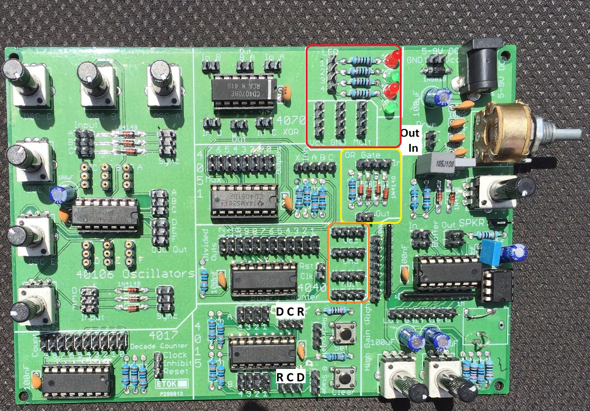

# lunetta-synth-gig
### Lunetta synthesizer for GIG workshop @ re:publica '17

Scroll down to see the various sections

The synthesizer consists of eight main sections:
1) Oscillators Section
2) Mixer Section
3) 4017 Decade counter
4) 4051 Multiplexer
5) 4040 Binary counter
6) 4070 XOR gate
7) 4015 Shift register
8) Drum section
9) Some LEDs, multiples, Vcc and Ground sprinkled around the board

[Sample patches here](https://github.com/avikd/lunetta-synth-gig/tree/master/patches)

This image shows all the sections populated on the main board.

## LEDs, Multiples & Vcc, Gnd 

